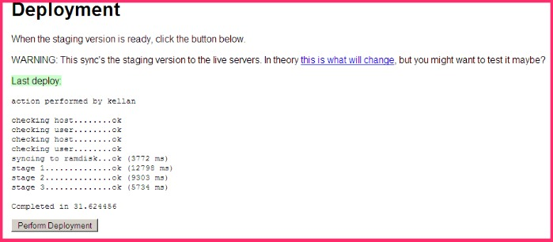
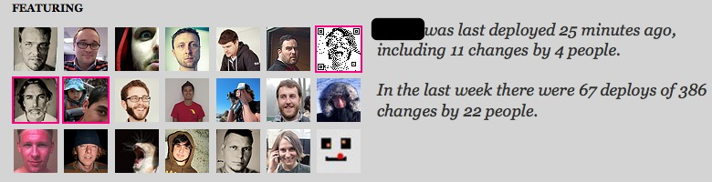
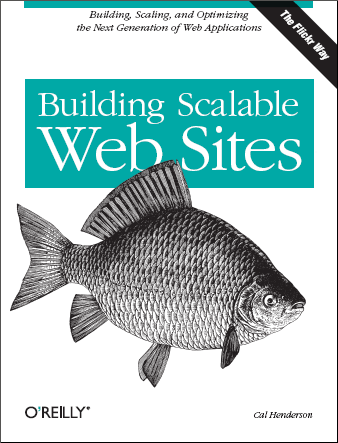

!SLIDE 
# One button deploys #

!SLIDE bullets 
# who is tv4?#
* Swedens largest commercial TV channel
* 900~ employees
* 10 channels and 25 local stations
* www.tv4.se, www.tv4play.se, fotbollskanalen.se, recept.nu

!SLIDE bullets 
# who is tv4 digital media?#
* 4 full time developers
* java, ruby, php, node
* operations and development

!SLIDE bullets 
#who am i
* developer - shackled to a cms 10+ years
* operations
* ruby/jruby since 2007

!SLIDE center
What's this?

!SLIDE center
Recognize this?

.notes from code.flickr.com

!SLIDE center
Read this?

.notes cal henderson

!SLIDE 
2005-6 search one button deploy 

.notes video flickr way to deploy
got my boss at the time to watch

!SLIDE center 

.notes cool but never going to happen

!SLIDE bullets
* spolsky test (2000)
* Can you make a build in 1 step

!SLIDE center

starting small

.notes cause you have nothging to begin with

!SLIDE bullets incremental
* Broken deliveries
* Software can't be deployed
* Continous Compilation

.notes new job/new tech/new company

!SLIDE 

!SLIDE 
* Continous Testing/metrics
* emma

!SLIDE
* first jenkins machine

!SLIDE xml smaller
    @@@ xml
    <target name="compile-jsp" depends="compile" 
            description="precompile jsp">
        <java classname="com.caucho.jsp.JspCompiler" 
              fork="true" failonerror="true">
          <classpath refid="resin.classpath" />
          <arg line="-app-dir ${src.web.dispatcher.dir} ${src.web.dispatcher.dir}" />
        </java>
    </target>

http://gist.github.com/320606.js?file=resin-jsp-compile.xml

!SLIDE
* Consitency
* OS
* Build tools (ant/maven)
* Editor (Intellj)
* Same build process local/jenkins

!SLIDE
* 2nd jenkins

!SLIDE
* Deploy till it doesn't hurt (much)
* Prod every 6-8 weeks
* Set up Continous Compilation, Continous Unit Testing
* Set up jenkins
* Deploy every week
    * Week 1 feature deploy (2 bug fixes)
    * Week 2 feature deploy (1 bug fix)
    * Week 3 feature deploy (0 bug fixes that couldn't wait)

!SLIDE
* Jenkins The ruby era(greenfield)
* No compile
* More tests
* Better Coverage
* Testing generated HTML(still no ajax)

!SLIDE
* WORDPRESS
* Define boundaries btwn ops/dev
* Deploy only wp-content
* It's just php

!SLIDE
* Mule
* Hot deploy ++
* Testing --
* Groovy (testing possible!)
* Deploy possibility service/system

!SLIDE
* Pragprog
* Only one editor
* Only one deploy system
* ci.sh

!SLIDE 
* cost of deploy
* $50 per deploy
  * $100 from tv4 employee(technical)
  * $100 from tv4 employee(nontechnical)
* if everything goes ok otherwise start over....

!SLIDE
* Async messaging
* I mail
* user filters.
    * 0 inbox kinda hard w/ 50 mail a day
* only broken or fixed(mail)

!SLIDE
* Not all systems can auto deploy
* CMS(Polopoly)
* Wordpress
* Mule (i have to copy how many petabytes)
* Ruby (Heroku, warbler, capistrano)
* Avoided db migrations so far.

!SLIDE center
#thanks#

http://http.tv4.se

@brianjriddle

http://github.com/TV4

http://github.com/brianjriddle

!SLIDE
http://eef-ink.com/i-gave-it-to-you-comic/

