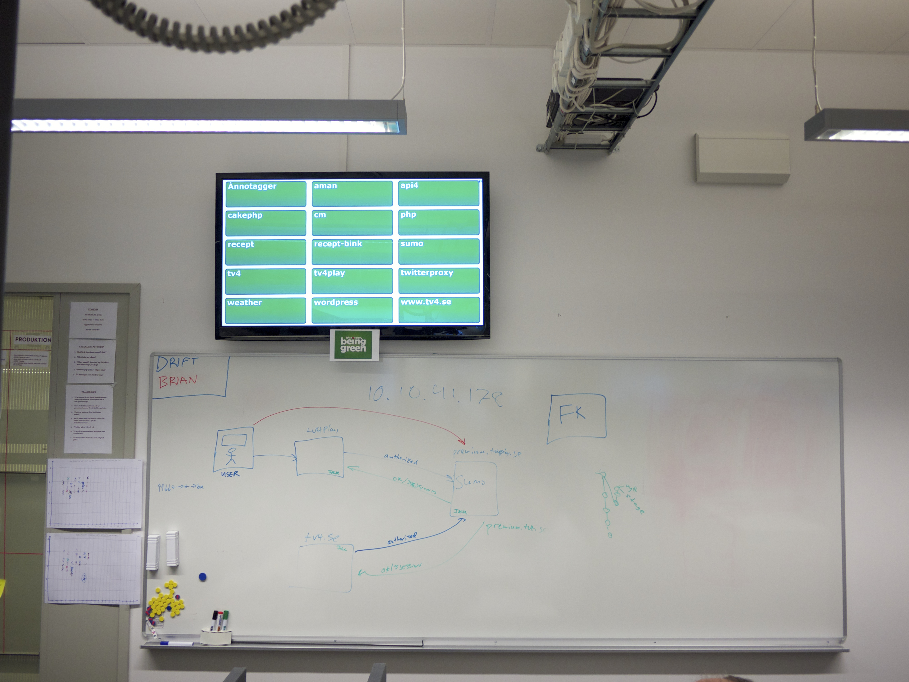

!SLIDE 
2007-8 cms migration

.notes Migration from custom cms to 'off' the shelf solution.
70.000 line java/jsp/html/js/xml ?HOW MANY?
15 testcases
deployed Prod irregular but could go as long as every 6-8 weeks

!SLIDE  transition=fade

.notes 
one group of developers/business managers per site. no processes.
may not be bad but engineering practices didn't exist either
Long deploy process
Silos everywhere

!SLIDE  transition=fade

start small

.notes cause you have nothing to begin with

!SLIDE  transition=fade
Consistency

OS

Build tools (ant/maven)

Editor (IntelliJ)

Can it compile?

.notes may not seem like much but all these small diffferences added up.

!SLIDE center transition=fade

first jenkins machine

.notes same machine as my development environment.

!SLIDE  transition=fade
    java -jar jenkins.war

.notes one terminal, one jar, alittle configuration and your off!

!SLIDE transition=fade 

.notes mandatory reading for anybody working with software.

!SLIDE center transition=fade
Start continuous testing

    ant test

.notes it shoud not be harder than running a single command.
Once you have it done locally getting it running in jenkins trivial

!SLIDE center transition=fade

metrics 

.notes legacy code. ours is probably never going to get better than this.
Euthanasia only hope for this code base.
at most we trust this code base 9%.
depressing but it was &lt;1%

!SLIDE xml smaller transition=fade
    @@@ xml
    <target name="compile-jsp" depends="compile" 
            description="precompile jsp">
        <java classname="com.caucho.jsp.JspCompiler" 
              fork="true" failonerror="true">
          <classpath refid="resin.classpath" />
          <arg line="-app-dir ${src.web.dispatcher.dir} ${src.web.dispatcher.dir}" />
        </java>
    </target>

http://gist.github.com/320606.js?file=resin-jsp-compile.xml

.notes compiling jsp is just as helpful as compiling java.
catches missed files, bad syntax, doesn't catch jstl-el though.
still worth failing the build.

!SLIDE  transition=fade
Deploy till it doesn't hurt (much)

Deploy every week

.notes Week 1 feature deploy (2 bug fixes)
Week 2 feature deploy (1 bug fix)
Week 3 feature deploy (0 bug fixes that couldn't wait)
then keep doing deploying everyweek.

!SLIDE center transition=fade

2nd jenkins

.notes - every IT department has at least one computer sitting around doing nothing.

!SLIDE center transition=fade
culture change - it's all about quality

.notes tired of always put out fires started looking. time to start getting rid of points of pain.
in with disqus/solr don't break the internet.

!SLIDE bullet incremental transition=fade
* cost of deploy
* $50 per deploy
* $100 from tv4 employee(technical)
* $100 from tv4 employee(nontechnical)

.notes if everything goes ok otherwise start over....

!SLIDE bullets incremental transition=fade

* gateway drugs
* j2ee => jruby => ruby
* heroku  => push it out

.notes  ruby via jruby was gate to faster and happier development 
heroku was showing us the value of deploying when ever we want

!SLIDE  transition=fade
the ruby era(greenfield)

No compile

More tests

Better Coverage

Testing generated HTML(still no ajax)
!SLIDE center transition=fade

.notes unit/functional/integration tests 
we don't brow beat to get better metrics but have nurtured a culture of testing

!SLIDE  transition=fade
Wordpress

Define boundaries btwn ops/dev

Deploy only wp-content

It's just php

.notes 300 blogs that use custom thems. started having all of wordpress in git. made deploys and
upgrades hard.  cut it down to wp-content and wp-admin that needs to be checked when upgrading wordpress.
deploys to stage and prod go out with in 2 minutes.

!SLIDE  transition=fade
Mule

Hot deploy ++

Testing --

Groovy (testing possible!)

Deploy possibility service/system dependent

!SLIDE  transition=fade transition=fade
Pragmatic Programmer

Only one editor

Only one deploy system

ci.sh

.notes having just one way to deploy (via jenkins) we miss the bus factor. 
when it's a matter of merging or pressing a button anybody can do it. that
should be encouraged.

!SLIDE bullets transition=fade
* visualizations/notifiactions

!SLIDE center

!SLIDE bullets transition=fade
* user filters
  * 0 inbox kinda hard w/ 50 mail a day
* only broken or fixed(mail)

!SLIDE bullets transition=fade
* Not all systems can auto deploy
* CMS(Polopoly)
* Wordpress how safe is that really?
* Mule (i have to copy how many petabytes)
* Ruby (Heroku, warbler, capistrano)

.notes Avoided db migrations so far but so what. even with db migrations it cane be done.

