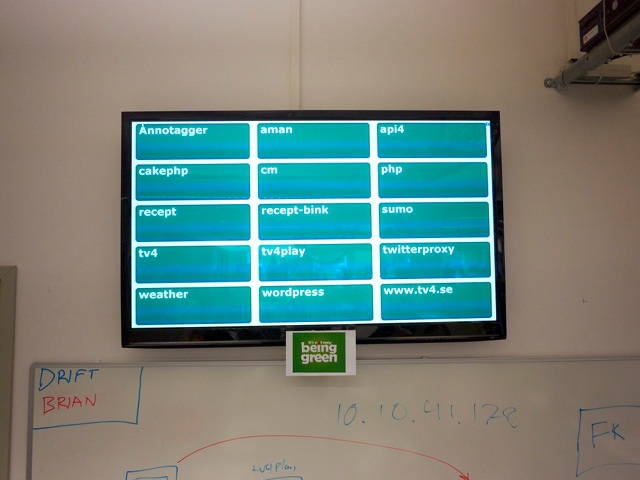
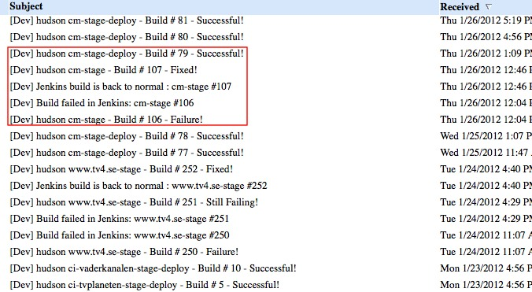
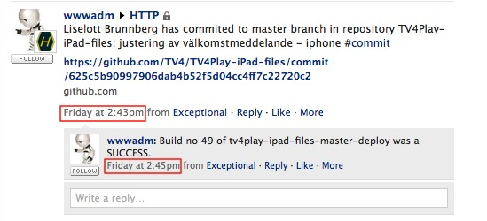

!SLIDE 
2007-8 cms migration

.notes Migration from custom cms to 'off' the shelf solution.
1.000.000 line java/jsp/html/js/xml don't read to much into this as
there 140.000 lines javascript. lots of cut and paste.
15 testcases 738 lines
deployed prod irregular but could go as long as every 6-8 weeks

!SLIDE  transition=fade

.notes one group of developers/business managers per site. no processes.
may not be bad but engineering practices didn't exist either
long time between deploy process
silos everywhere

!SLIDE  transition=fade

start small

.notes cause you have nothing to begin with

!SLIDE bullets center transition=fade
* consistency
* os
* build tools (ant/maven)
* editor (intellij)
* can it compile?

.notes may not seem like much but all these small differences added up.

!SLIDE center transition=fade

first jenkins server

.notes same machine as my development environment.

!SLIDE center transition=fade
    java -jar jenkins.war

.notes one terminal, one jar, a little configuration and your off!

!SLIDE center transition=fade 

.notes mandatory reading for anybody working with software.

!SLIDE center transition=fade
start continuous testing

    ant test

.notes it shoud not be harder than running a single command.
Once you have it done locally getting it running in jenkins trivial

!SLIDE center transition=fade

metrics 

.notes legacy code. ours is probably never going to get better than this.
Euthanasia only hope for this code base.
at most we trust this code base 9%.
depressing but it was &lt;1%

!SLIDE xml smaller transition=fade
    @@@ xml
    <target name="compile-jsp" depends="compile" 
            description="precompile jsp">
        <java classname="com.caucho.jsp.JspCompiler" 
              fork="true" failonerror="true">
          <classpath refid="resin.classpath" />
          <arg line="-app-dir ${src.web.dispatcher.dir}
          ${src.web.dispatcher.dir}" />
        </java>
    </target>

http://gist.github.com/320606.js?file=resin-jsp-compile.xml

.notes compiling jsp is just as helpful as compiling java.
catches missed files, bad syntax, doesn't catch jstl-el though.
still worth failing the build.

!SLIDE bullets center transition=fade
* deploy till it doesn't hurt (much)
* deploy every week

.notes Week 1 feature deploy (2 bug fixes)
Week 2 feature deploy (1 bug fix)
Week 3 feature deploy (0 bug fixes that couldn't wait)
then keep doing deploying everyweek.

!SLIDE center transition=fade

second jenkins server

.notes - every IT department has at least one computer sitting around doing nothing.

!SLIDE center transition=fade
culture change - it's all about quality

.notes tired of always put out fires.
time to start getting rid of points of pain.
in with disqus/solr.
don't break the internet.
puts quality first.

!SLIDE bullets center transition=fade
* ruby
* no compile
* more tests
* testing generated html
* better coverage

.notes greenfield development it is still development. 
still no ajax

!SLIDE center transition=fade

.notes ruby and jruby was gate to faster and happier development
infrastructure for unit/functional/integration tests.
we don't brow beat to get better metrics but have tried to nurture a culture of testing

!SLIDE bullets incremental transition=fade
* what does it cost to deploy?
* $50 per deploy
* $100 from tv4 employee(technical)
* $100 from tv4 employee(nontechnical)

.notes CMS if everything goes ok otherwise start over....
lots of hand holding.

!SLIDE bullets center transition=fade
* git push origin master

.notes transition from svn to git. 
partly b/c of rails community
partly b/c subversion stinks
partly b/c we this is how we deploy to heroku

!SLIDE bullets center transition=fade
* git push heroku master

.notes everybody in the team could do this. when ever they needed. 
heroku was showing us the value of deploying when ever we want
this is extremely seductive

!SLIDE transition=fade

##could we do this with the other projects?

.notes and does it have to be a person that does it can't it happen automatically? 
this is when we really started making jenkins work hard

!SLIDE bullets center transition=fade
* CMS
* redefine deliverables
* not perfect but good enough

.notes was delivering a VCS tag. had to change to a binary.
have to draw a line somewhere. 
stage goes out immediately.
OBS takes about 30 minutes to do release to stage (20 to prod) and cannot publish during deploy. 
for a news site that can be a catastrophe.

!SLIDE bullets  transition=fade
* wordpress
* define boundaries btwn ops/dev
* deploy only wp-content
* it's just php

.notes 300 blogs that use custom wordpress themes. 
started having all of wordpress in git. 
made deploys and upgrades hard.  
cut it down to wp-content and wp-admin that needs to be checked when upgrading wordpress.
deploys to stage and prod go out within 2 minutes of a commit.
OBS wordpress one plugin between having not having a site. how safe is that really?

!SLIDE bullets transition=fade
* mule
* hot deploy++
* testing--
* groovy (testing possible!)
* deployment service/system dependent

.notes mule ESB.  
great that you can hot deploy
after testing with test/unit, rspec, cucumber it just stinks.
mule some systems just can't be deployed at will.  

!SLIDE bullets center transition=fade
* pragmatic programmer
* only one editor
* only one way to deploy
* ci.sh

.notes having just one way to deploy (via jenkins) means less of a bus factor. 
when it's a matter of merging or pressing a button anybody can do it. that
should be encouraged.

!SLIDE center transition=fade

visualizations

.notes it took along time to get a radiator installed and being a tv station we have tons of tvs. 
everybody in the entire room may not know what those green boxes mean but everybody knows red means
something broke.

!SLIDE center transition=fade

mail

.notes only broken or fixed mail
0 inbox kinda hard w/ 50 mail a day
easy for developers to ignore a mail.
we send mail when something breaks or is deploy as that is
something that should be noticed.

!SLIDE center transition=fade

yammer

.notes we don't have hubot but we do use yammer.
lots of notifications get pushed to yammer

!SLIDE bullets center transition=fade
* is it worth it?

.notes it's taken 4 years to get to this point.
since deploy's are so easy there is no drama and a lot less stress.
around 1 day a month spent getting various parts working.
hardest part has been trying to break development down to small deployable bits.
project managers don't need to plan in deploys in advance b/c it's done all the time.

!SLIDE
#questions?
